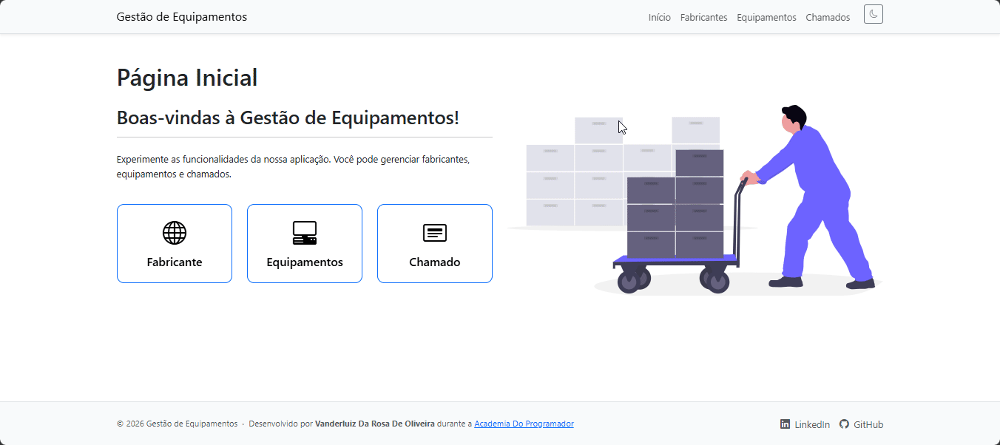

# 🛠️ Gestão de Equipamentos

Um sistema web desenvolvido para automatizar o controle de inventário de equipamentos e o registro de chamados de manutenção, substituindo o controle manual feito por planilhas. Projeto desenvolvido como parte das atividades da **Academia do Programador**.

🌐 **Acesse a aplicação online:** [Gestão de Equipamentos - Azure](https://gestao-de-equipamento-c8dcgchjf8h2a5gf.canadaeast-01.azurewebsites.net/)

---

## 🎯 Funcionalidades

O sistema foi dividido em três módulos principais para atender às necessidades de controle de estoque e manutenção:

<p align="center">
  
</p>

### 🏭 1. Controle de Fabricantes
Permite gerenciar as empresas que fabricam os equipamentos do inventário.
* **Cadastrar, Editar e Excluir** fabricantes.
* **Dados registrados:** Nome, E-mail e Telefone de contato.
* Integração direta com o cadastro de equipamentos.

### 💻 2. Controle de Equipamentos
Gestão do inventário físico da empresa.
* **Cadastrar, Editar e Excluir** equipamentos.
* **Dados registrados:** Nome (mínimo 3 caracteres), Preço de aquisição, Fabricante (vinculado ao módulo anterior) e Data de fabricação.
* Visualização completa em formato de lista atualizada dinamicamente.

### 🔧 3. Controle de Chamados
Registro do histórico de manutenções de cada equipamento.
* **Cadastrar, Editar e Excluir** chamados de manutenção.
* **Dados registrados:** Título, Descrição, Equipamento associado e Data de abertura.
* **Cálculo automático:** O sistema exibe visualmente o número de dias que um chamado está aberto.

---

## 🚀 Tecnologias Utilizadas

* **Backend:** C# com ASP.NET Core MVC
* **Frontend:** HTML5, CSS3 e Bootstrap 5 (Design Responsivo)
* **Armazenamento de Dados:** Persistência em arquivo `.json` (Repositório local sem necessidade de banco de dados relacional)
* **Hospedagem & Deploy:** Microsoft Azure (App Service) com CI/CD via GitHub.
    * 🔗 **Ambiente de Produção:** [gestao-de-equipamento-c8dcgchjf8h2a5gf.canadaeast-01.azurewebsites.net](https://gestao-de-equipamento-c8dcgchjf8h2a5gf.canadaeast-01.azurewebsites.net/)

---

## ⚙️ Como executar o projeto localmente

**Pré-requisitos:**
* [.NET SDK](https://dotnet.microsoft.com/download) instalado na sua máquina (versão correspondente ao projeto).
* Visual Studio, VS Code ou outra IDE de sua preferência.

1. Faça o clone do repositório:
```bash
git clone https://github.com/Vanderluizsj/GestaoDeEquipamentos.git